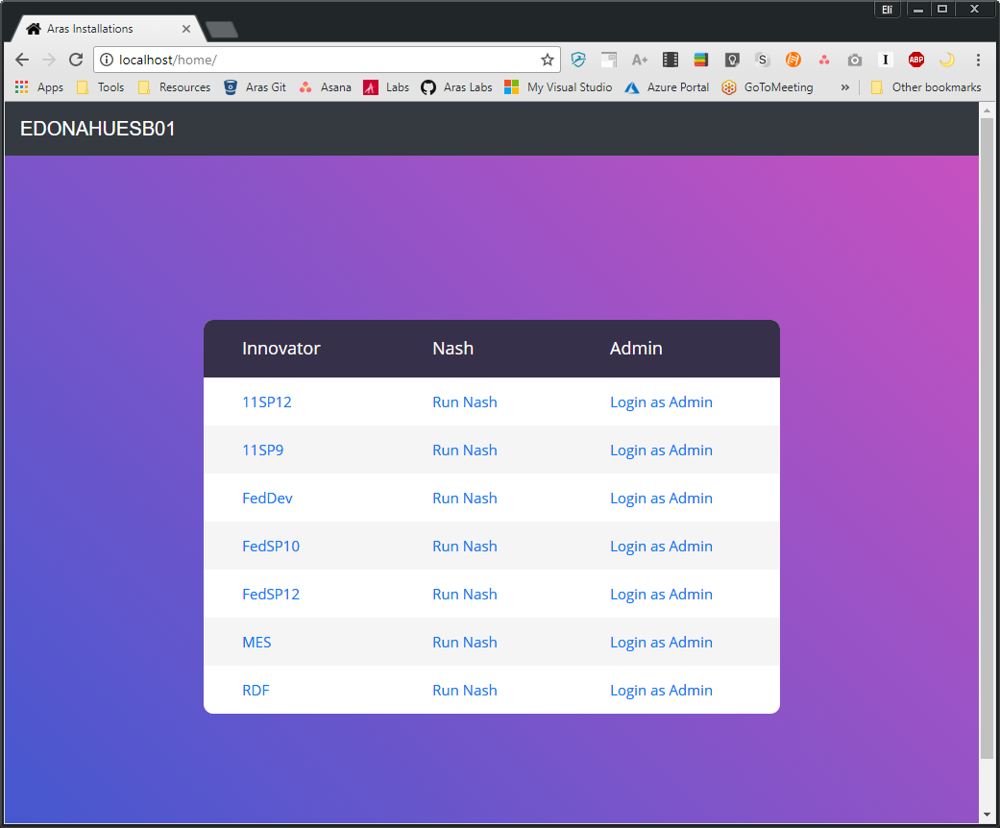

# Aras Homepage

This project sets up a "homepage" that lists the Aras Innovator instances installed on a server. The list contains links to each instance's login page and Nash page. The homepage acts as a directory for easy access to your Aras Innovator installations.

Works for all versions of Aras Innovator.

## Installation

### Install Steps

1. Download the aras-homepage project.
2. Copy the `home` folder from the project and paste it into `C:\inetpub\wwwroot` on the server.
3. Open `home\default.aspx` for editing.
4. Set the server name in the nav bar.

    ```
    <!-- Navbar content -->
    <a class="navbar-brand" href="#">SERVER NAME</a> 
    ```
5. Set the root variable to the folder where your Aras instances are installed.

    ```
    string root = "C:\\Program Files (x86)\\Aras";
    ```

5. If there are any subfolders you don't want listed in the table, add them to the skip list.

    ```
    skip.Add("folder_name");
    ```

6. Save the `default.aspx` file.

## Usage



Open your browser to http://servername/home. Bookmark the url or make it your browser homepage for easy access to your server's Innovator instances.

## Contributing

1. Fork it!
2. Create your feature branch: `git checkout -b my-new-feature`
3. Commit your changes: `git commit -am 'Add some feature'`
4. Push to the branch: `git push origin my-new-feature`
5. Submit a pull request

For more information on contributing to this project, another Aras Labs project, or any Aras Community project, shoot us an email at araslabs@aras.com.

## Credits

Created by Eli Donahue. 

Project inspired by George J. Carrette.

Table style is based on [this template](https://colorlib.com/etc/tb/Table_Responsive_v1/index.html).

## License

Aras Labs projects are published to Github under the MIT license. See the [LICENSE file](./LICENSE.md) for license rights and limitations.