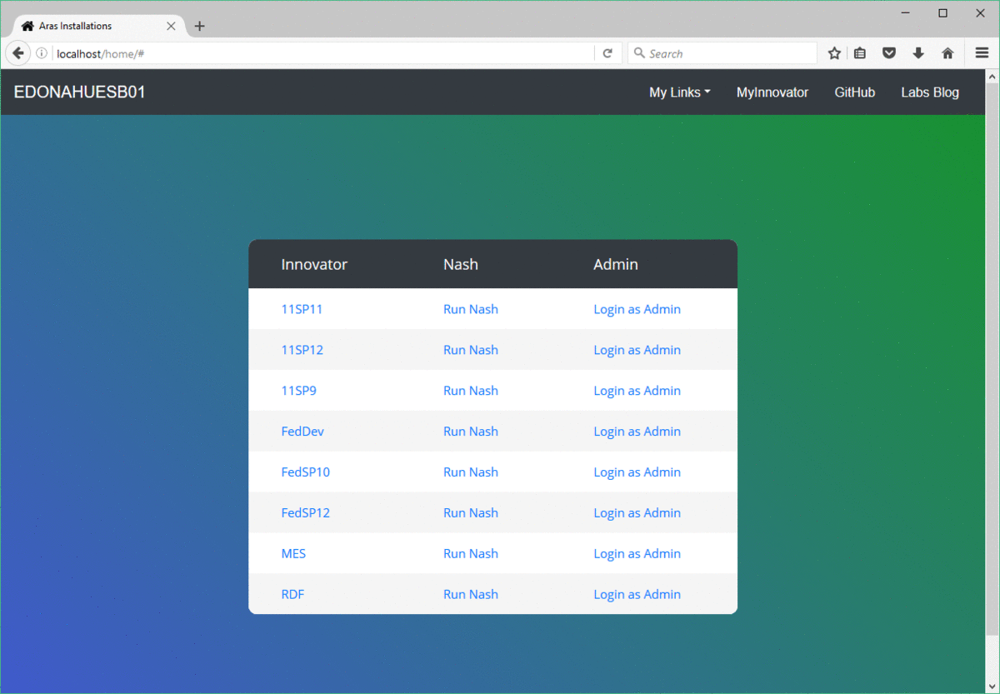

# Aras Homepage

This project sets up a "homepage" that lists the Aras Innovator instances installed on a server. The list contains links to each instance's login page and Nash page. The homepage acts as a directory for easy access to your Aras Innovator installations.

Works for all versions of Aras Innovator.

## Installation

### Install Steps

1. Download the aras-homepage project.
2. Copy the `home` folder from the project and paste it into `C:\inetpub\wwwroot` on the server.
3. Open `home\default.aspx` for editing.
4. Set the server name in the nav bar.

    ```(html)
    <!-- Navbar content -->
    <a class="navbar-brand" href="#">SERVER NAME</a> 
    ```
5. Set the root variable to the folder where your Aras instances are installed.

    ```(html)
    // path where Innovator instances are installed
    string root = "C:\\Program Files (x86)\\Aras";
    ```

5. If there are any subfolders you don't want listed in the table, add them to the skip list.

    ```(html)
    // create a list of folder names you don't want listed
    List<string> skip = new List<string>();
    skip.Add("Aras Update");
    ```

6. If you want to customize the background style, you can choose or edit a stylesheet.

    ```(html)
    <!-- 
    choose or customize a stylesheet to style the page background 
    find stylesheets in home/css/
    -->
	<link rel="stylesheet" type="text/css" href="css/blue-purple.css">
	<!-- <link rel="stylesheet" type="text/css" href="css/blue-green.css"> -->
	<!-- <link rel="stylesheet" type="text/css" href="css/photo.css"> -->
    ```

7. If you want to show custom links in the navigation bar, you can add them to the `links` Dictionary.

    ```(html)
    // create a dictionary of links you want to show in the nav bar
    Dictionary<string,string> links = new Dictionary<string,string>();
    links["MyInnovator"] = "https://MyInnovator.com/";
    ```

8. If you have links you want to show in a dropdown list from the navigation bar, you can add them to the `links_2` Dictionary.

    ```(html)
    // create a dictionary of links you want to show in the dropdown list
    Dictionary<string,string> links_2 = new Dictionary<string,string>();
    links_2["Aras Roadmap"] = "https://www.aras.com/plm-roadmap/";
    ```

9. Save the `default.aspx` file.

## Usage



Open your browser to http://servername/home. Bookmark the url or make it your browser homepage for easy access to your server's Innovator instances.

## Contributing

1. Fork it!
2. Create your feature branch: `git checkout -b my-new-feature`
3. Commit your changes: `git commit -am 'Add some feature'`
4. Push to the branch: `git push origin my-new-feature`
5. Submit a pull request

For more information on contributing to this project, another Aras Labs project, or any Aras Community project, shoot us an email at araslabs@aras.com.

## Credits

Created by Eli Donahue. 

Project inspired by George J. Carrette.

Table style is based on [this template](https://colorlib.com/etc/tb/Table_Responsive_v1/index.html).

Background photos are sourced from [UnSplash](https://unsplash.com/).

## License

Aras Labs projects are published to Github under the MIT license. See the [LICENSE file](./LICENSE.md) for license rights and limitations.